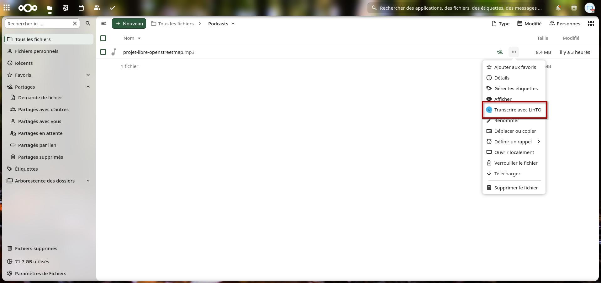
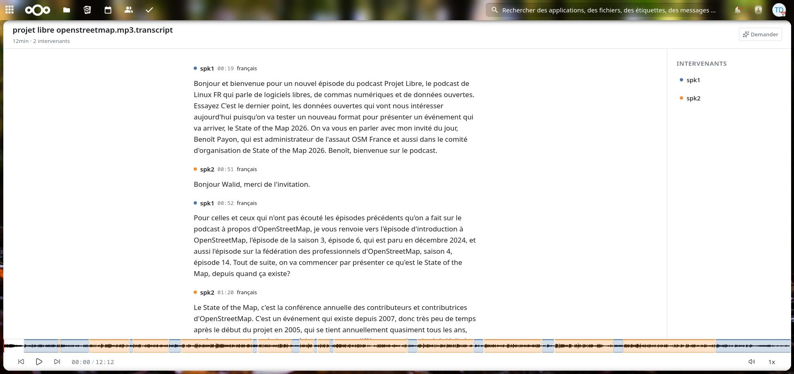

# LinTO for Nextcloud

Audio transcription and transcript editing for Nextcloud, powered by [LinTO](https://linto.ai).

## Features

### Automatic transcription

Right-click any audio file in Nextcloud Files and select **Transcribe with LinTO**. The file is sent to your organization's LinTO Studio instance, transcribed, and the result comes back as a `.transcript` file next to the original — speakers identified, timestamps included.

### A transcription editor, powered by LinTO Studio

Opening a `.transcript` file gives you the same editor that powers [LinTO Studio](https://studio.linto.app): edit text, split and merge speech turns, rename or merge speakers — all synced with the audio waveform.

This is the same core component as LinTO Studio, not a stripped-down clone — but it isn't the full product either: report generation and DOCX export aren't part of this integration. For those, and for live transcription, see [studio.linto.app](https://studio.linto.app).

## Privacy

Once a transcript is saved locally, that's it — no further calls to LinTO's API. Editing (text, turns, speakers) happens entirely on your Nextcloud instance and is saved back to the local `.transcript` file.

By default, the remote copy is also deleted from LinTO Studio as soon as the local one is saved — nothing lingers on LinTO's servers either.

## Configuration

Before transcription works, a Nextcloud administrator needs to configure LinTO's credentials in **Settings → Administration → LinTO**:

- **LinTO API URL** — your LinTO Studio instance (e.g. `https://studio.linto.ai`)
- **Organisation ID** — your LinTO organisation
- **API Key** — an API key for that organisation

*Delete the transcription from LinTO Studio once finished, keep only the local copy* is enabled by default — see [Privacy](#privacy) above.

## License

AGPL-3.0-or-later
